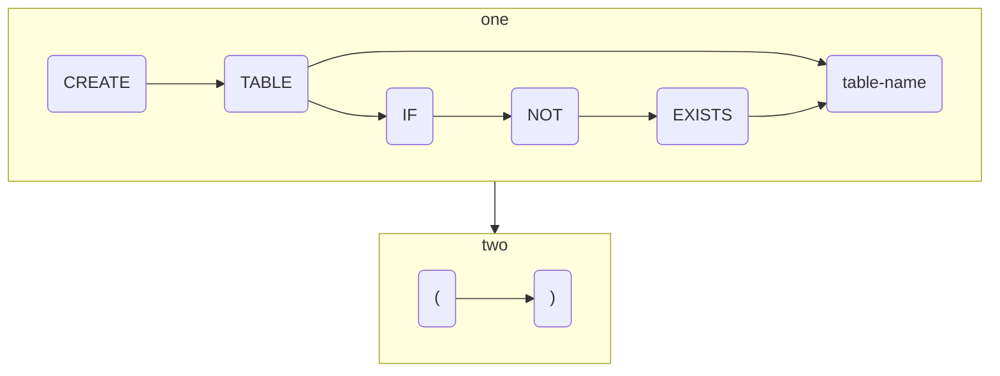
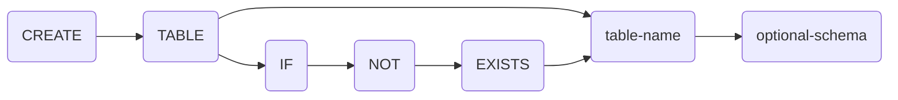
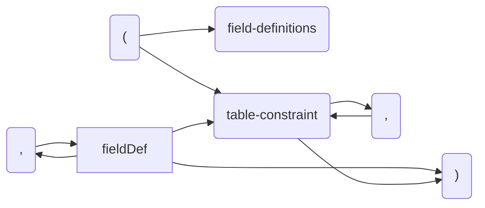

## Synopsis

```sql
CREATE TABLE [ IF NOT EXISTS ] table_name
  [optional_schema]

optional_schema:
  (
        [ field_constraint [ , ... ] ]
      | [ table constraint [ , ... ] ]
  )
```





optional-schema:



```pikchr
box color red wid 2.6in \
    "Click on any diagram on this page" big \
    "to see the Pikchr source text" big
```
